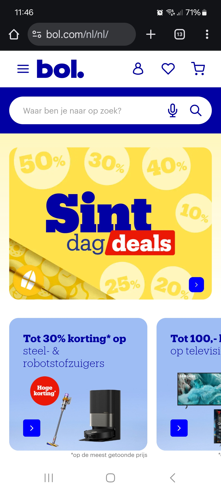
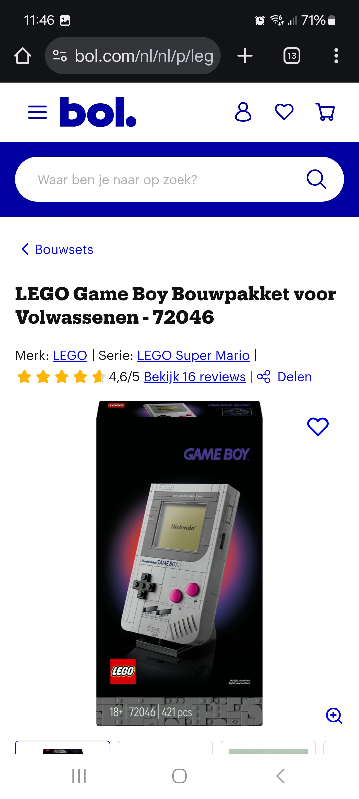
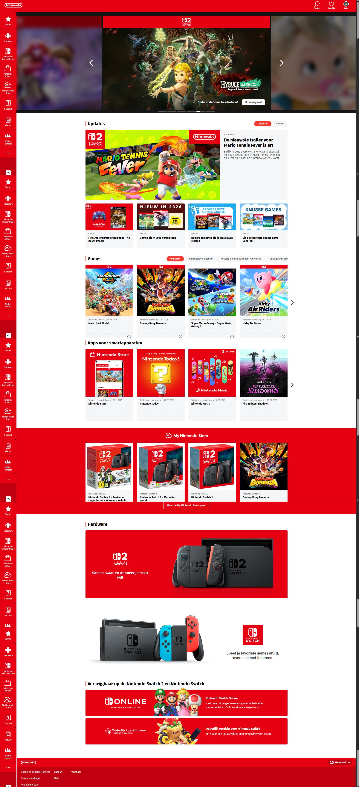
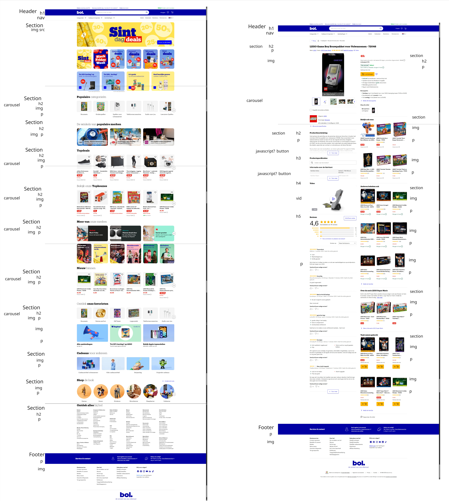

# Procesverslag
Markdown is een simpele manier om HTML te schrijven.  
Markdown cheat cheet: [Hulp bij het schrijven van Markdown](https://github.com/adam-p/markdown-here/wiki/Markdown-Cheatsheet).

Nb. De standaardstructuur en de spartaanse opmaak van de README.md zijn helemaal prima. Het gaat om de inhoud van je procesverslag. Besteedt de tijd voor pracht en praal aan je website.

Nb. Door *open* toe te voegen aan een *details* element kun je deze standaard open zetten. Fijn om dat steeds voor de relevante stuk(ken) te doen.

## Jij

  
uitwerken voor kick-off werkgroep

  ### Auteur:
  Jake laan

  #### Je startniveau:
  blauw

  #### Je focus:
  Responsive
 

## Je website

  
uitwerken voor kick-off werkgroep

  ### Je opdracht:
  link naar de website die je gaat namaken óf de naam/omschrijving van je eigen ontwerp

  #### Screenshot(s) van de eerste pagina (small screen): 
  Hoofd pagina
  

  #### Screenshot(s) van de tweede pagina (small screen):
  Product pagina
  
 

  Homepage 2
  

## Toegankelijkheidstest 1/2 (week 1)

  
uitwerken na test in 2e werkgroep

  ### Bevindingen
  Lijst met je bevindingen die in de test naar voren kwamen:
  
  
  
  
  

## Breakdownschets (week 1)

  
uitwerken na afloop 3e werkgroep

  ### de hele pagina: 
  

  Schets V2:
  

## Voortgang 1 (week 2)

  
uitwerken voor 1e voortgang

  ### Stand van zaken
  hier dit ging goed & dit was lastig (neem ook screenshots op van delen van je website en code)

  ### Agenda voor meeting
  samen met je groepje opstellen

  | student 1      | student 2          | student 3    | student 4        |
  | ---            | ---                | ---          | ---              |
  | dit bespreken  | en dit             | en ik dit    | en dan ik dat    |
  | en dat ook nog | dit als er tijd is | nog een punt | dit wil ik zeker |
  | ...            | ...                | ...          | ...              |

  ### Verslag van meeting
  Breakdown schets was goed, wel nog kijken waar h2 h3 etc moet staan.
  Niet alle sections hoeven gemaakt te worden als ze hetzelfde zijn als een andere.
  HTML was nog niet goed, maar dat wist ik al. Had HTML voor de breakdown schets gemaakt.
  Vrisse start maken met HTML
  H1 hidden maken of echt de kop van de pagina zijn.

## Voortgang 2 (week 3)

  
uitwerken voor 2e voortgang

  ### Stand van zaken
  hier dit ging goed & dit was lastig (neem ook screenshots op van delen van je website en code)

  ### Agenda voor meeting
  samen met je groepje opstellen

  | student 1      | student 2          | student 3    | student 4        |
  | ---            | ---                | ---          | ---              |
  | dit bespreken  | en dit             | en ik dit    | en dan ik dat    |
  | en dat ook nog | dit als er tijd is | nog een punt | dit wil ik zeker |
  | ...            | ...                | ...          | ...              |

  ### Verslag van meeting
  hier na afloop snel de uitkomsten van de meeting vastleggen

  - punt 1: Mobile first maken
  - punt 2: Header en footer compleet. Niks boven de header en niks onder de footer.
  - nog een punt
- ...

## Toegankelijkheidstest 2/2 (week 4)

  
uitwerken na test in 9e werkgroep

  ### Bevindingen
  Lijst met je bevindingen die in de test naar voren kwamen (geef ook aan wat er verbeterd is):

## Voortgang 3 (week 4)

  
uitwerken voor 3e voortgang

  ### Stand van zaken
  hier dit ging goed & dit was lastig (neem ook screenshots op van delen van je website en code)

  ### Agenda voor meeting
  samen met je groepje opstellen

  | student 1      | student 2          | student 3    | student 4        |
  | ---            | ---                | ---          | ---              |
  | dit bespreken  | en dit             | en ik dit    | en dan ik dat    |
  | en dat ook nog | dit als er tijd is | nog een punt | dit wil ik zeker |
  | ...            | ...                | ...          | ...              |

  ### Verslag van meeting
  hier na afloop snel de uitkomsten van de meeting vastleggen

  - punt 1
  - punt 2
  - nog een punt
  - ...

## Eindgesprek (week 5)

  
uitwerken voor eindgesprek

  ### Je uitkomst - karakteristiek screenshots:
  

  ### Dit ging goed/Heb ik geleerd: 
  Korte omschrijving met plaatjes

  

  ### Dit was lastig/Is niet gelukt:
  Korte omschrijving met plaatjes

  

## Bronnenlijst

  
continu bijhouden terwijl je werkt

  Nb. Wees specifiek ('css-tricks' als bron is bijv. niet specifiek genoeg). 
  Nb. ChatGpT en andere AI horen er ook bij.
  Nb. Vermeld de bronnen ook in je code.

  1. https://www.w3schools.com/tags/att_input_type_search.asp  
  2. https://www.w3schools.com/html/html_formatting.asp
  3. https://www.w3schools.com/howto/howto_css_image_text.asp
  4. Chatgpt - Prompt: "Hoe zorg ik er voor dat deze afbeelding en text in het midden wordt gezet?"
  5. Chatgpt - Prompt: "Hoe maak je van deze h3> en p> 4 kolomen en 3 rijen?"
  6. Chatgpt - Prompt: "Hoe maak ik voor deze section een simpele carousel die eerst 4 afbeeldingen laat zien en dan de rest?"
  7. https://www.w3schools.com/howto/howto_css_dropdown.asp
  8. Chatgpt- Prompt: "Hoe maak ik een verticale navigatie balk?"
  9.  https://www.w3schools.com/howto/howto_js_sidenav.asp
  10. Chatgpt- Prompt: "Hoe zorg ik er voor dat als je buiten het pop up menu klikt deze verdwijnt?"
  11. https://www.w3schools.com/howto/howto_css_transition_hover.asp
  12. https://cssgrid-generator.netlify.app/
  13. ChatGPT prompt: "hoe maak ik een embedded Youtube video responsive?"
  14. hamburger menu voor table en phone Chatgpt prompt: Hoe maak ik hier een hamburger menu die alleen te zien is op tablet en phone?

